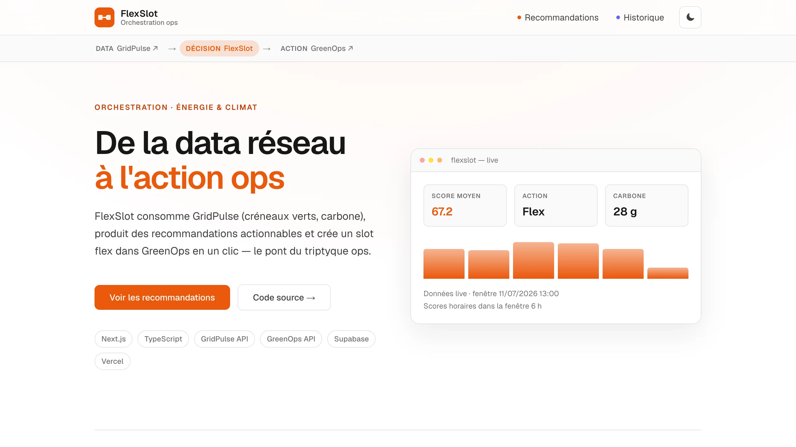
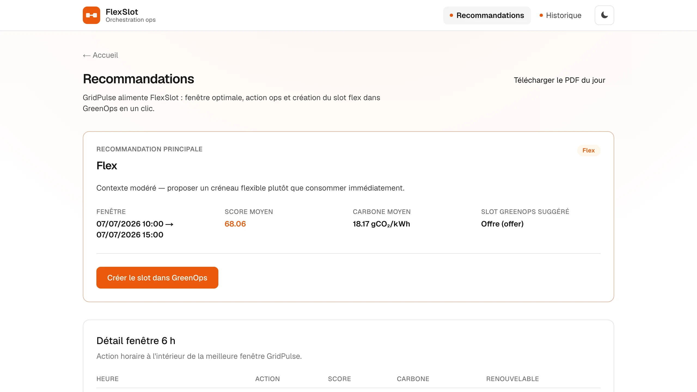
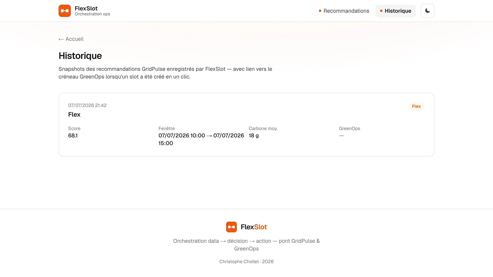

# FlexSlot

Couche d'**orchestration ops** entre [GridPulse](https://github.com/ChristopheChollet/GridPulse) (données réseau) et [GreenOps](https://github.com/ChristopheChollet/GreenOps) (actions métier) : consomme les créneaux verts, produit des recommandations horaires actionnables, crée un créneau flex en un clic.

## Chaîne produit

```
GridPulse  →  FlexSlot  →  GreenOps
  data         décision       action
```

GridPulse indique **quand** le réseau est favorable ; FlexSlot traduit la fenêtre en **consommer / flex / décaler** ; GreenOps **enregistre** le créneau flex avec traçabilité GridPulse.

## Captures d'écran

| Landing | Recommandations | Historique |
|---|---|---|
|  |  |  |

## Architecture

```
GridPulse API (Railway)
        │  GET /api/v1/green-windows
        ▼
FlexSlot (Next.js · Vercel)
        │  moteur reco + UI
        │  POST GreenOps /api/integrations/flex-slots
        ▼
GreenOps (Supabase · flex_slots)
```

## Fonctionnalités

- Landing avec KPIs live (GridPulse) et mini-graphique des scores horaires
- Page **Recommandations** : fenêtre 6 h, détail par heure, alternatives
- **Créer le slot dans GreenOps** en un clic (intégration service-to-service)
- Export **PDF** de la recommandation du jour
- Thème jour/nuit, liens croisés GridPulse ↔ GreenOps

## Stack

- **Next.js 16** (App Router) · TypeScript · Tailwind 4
- Appels server-side vers GridPulse API et GreenOps (clé d'intégration)
- **@react-pdf/renderer** pour l'export PDF
- **Vercel**

## Variables d'environnement

Voir [`.env.example`](.env.example) :

| Variable | Description |
|----------|-------------|
| `GRIDPULSE_API_URL` | API GridPulse (Railway ou local `:8000`) |
| `GREENOPS_API_URL` | URL GreenOps (local ou Vercel) |
| `GREENOPS_SERVICE_KEY` | Clé partagée avec GreenOps (migration `004_flexslot_integration`) |
| `GREENOPS_DEMO_ORG_ID` | `org_id` cible pour la création de slots |
| `SUPABASE_URL` | Même projet Supabase que GreenOps (historique V2) |
| `SUPABASE_SERVICE_ROLE_KEY` | Clé service role (écriture snapshots, serveur uniquement) |
| `FLEXSLOT_ALERT_WEBHOOK_URL` | Webhook alertes V2.1 (Slack, Discord, …) |
| `FLEXSLOT_CARBON_ALERT_THRESHOLD_GCO2` | Seuil carbone gCO₂/kWh (défaut `200`) |
| `FLEXSLOT_ALERT_ACTIONS` | Actions déclenchant l'alerte (défaut `defer`) |
| `CRON_SECRET` | Secret pour `GET /api/cron/check-alerts` |
| `NEXT_PUBLIC_GRIDPULSE_DEMO_URL` | Lien landing → GridPulse |
| `NEXT_PUBLIC_GREENOPS_DEMO_URL` | Lien landing → GreenOps |

## Démarrage local

Prérequis : GridPulse API (`:8000`) et GreenOps (`:3000`) accessibles, migrations GreenOps `004` + FlexSlot `001` appliquées sur Supabase.

```bash
npm install
cp .env.example .env.local
npm run dev
```

Ouvrir [http://localhost:3002](http://localhost:3002) — port **3002** pour éviter le conflit avec GreenOps (`3000`) et GridPulse front.

```bash
npm test   # vitest — moteur de recommandation
```

## Parcours démo (~2 min)

1. Landing : vérifier les KPIs (score, action, carbone) alimentés par GridPulse.
2. **Recommandations** : parcourir la fenêtre 6 h et les actions horaires.
3. **Créer dans GreenOps** : valider la redirection vers le slot créé (`source=flexslot`).
4. Télécharger le **PDF** depuis la page recommandations.
5. **Historique** : vérifier le snapshot et le lien GreenOps après création de slot.
6. Enchaîner depuis [GridPulse](https://grid-pulse-steel.vercel.app) ou [GreenOps](https://green-ops-five.vercel.app) via la chaîne ops.

## Déploiement (Vercel)

- Importer le repo, définir `GRIDPULSE_*`, `GREENOPS_*`, `NEXT_PUBLIC_*`.
- CORS : autoriser l'origine FlexSlot sur l'API GridPulse si besoin.
- GreenOps : `GREENOPS_SERVICE_KEY` identique des deux côtés.

Démo : [flex-slot.vercel.app](https://flex-slot.vercel.app)

## V2 — livré

- **Historique** — snapshots Supabase des recommandations (`/history`), lien slot GreenOps
- Déduplication 15 min par fenêtre · enregistrement à la visite `/recommendations`

Migration : [`supabase/migrations/001_flexslot_recommendation_history.sql`](supabase/migrations/001_flexslot_recommendation_history.sql) sur le **même** projet Supabase que GreenOps.

Variables : `SUPABASE_URL`, `SUPABASE_SERVICE_ROLE_KEY` (service role, jamais côté client).

## V2.1 (alertes ops) — livré

- **Webhook** quand l'action principale est **Décaler** (`defer`) ou carbone ≥ seuil
- Déduplication 15 min alignée sur l'historique (pas de spam)
- **Cron optionnel** : `GET /api/cron/check-alerts` avec header `Authorization: Bearer <CRON_SECRET>`

Variables : `FLEXSLOT_ALERT_WEBHOOK_URL`, `FLEXSLOT_CARBON_ALERT_THRESHOLD_GCO2` (défaut 200), `FLEXSLOT_ALERT_ACTIONS` (défaut `defer`), `CRON_SECRET`.

Guide complet : [`docs/ALERTES.md`](./docs/ALERTES.md) (Slack, Discord, Vercel Cron, tests curl).

## V3 (optionnel)

> Détail consolidé écosystème : [portfolio `docs/V3-ROADMAP.md`](https://github.com/ChristopheChollet/portfolio-starter-kit/blob/main/docs/V3-ROADMAP.md).

- Alertes e-mail (Resend / SMTP)
- Auth multi-org FlexSlot

## Limites (assumées)

- Intégration GreenOps par clé de service (pas OAuth machine-to-machine complet)
- Moteur de règles sur scores GridPulse, pas de ML propriétaire
- Démo **non réglementaire** — pas un outil de dispatch réseau

## Famille de produits

| Projet | Rôle | Stack |
|--------|------|-------|
| [GridPulse](https://github.com/ChristopheChollet/GridPulse) | Data mix & carbone | FastAPI · Supabase · Next.js |
| **FlexSlot** | Orchestration & reco | Next.js |
| [GreenOps](https://github.com/ChristopheChollet/GreenOps) | Console flex & REC | Next.js · Supabase |

## Licence

MIT — Christophe Chollet
